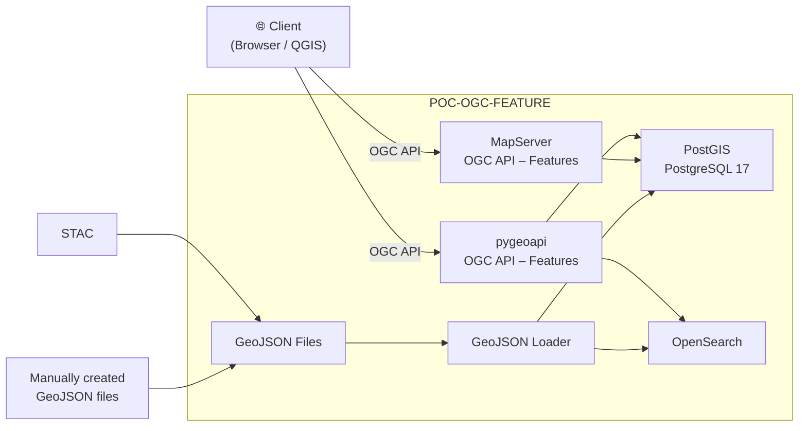

# MapServer vs PyGeoAPI

---

## Why are we comparing MapServer and PyGeoAPI?

Our goal by the end of the year:

**Serve ch.meteoschweiz.ogd-local-forecasting data via OGC API – Features.**

https://data.geo.admin.ch/browser/index.html#/collections/ch.meteoschweiz.ogd-local-forecasting?.language=en

---

## But... WTF is OGC API? And what's the Feature Part?

The **OGC API** is a family of standards for serving geospatial data over the web, built on REST/OpenAPI principles.

| Standard | Description |
| -------- | ----------- |
| **Common** | Shared building blocks (landing page, conformance, collections) used by all other OGC API standards |
| **Features** | Query, create, modify, and delete vector feature data (points, lines, polygons) |
| **Maps** | Request rendered map images (the modern successor to WMS) |
| **Tiles** | Retrieve pre-rendered or vector tiles of geospatial data for performant map display |
| **Records** | Discover and search geospatial resource metadata in catalogues |

---

## More niche standards for our Use Case

| Standard | Description |
| -------- | ----------- |
| **Coverages** | Access multi-dimensional raster data such as satellite imagery, sensor grids, and data cubes |
| **Processes** | Execute server-side geospatial processing tasks and chain workflows |
| **EDR** | Retrieve environmental data (weather, ocean, climate) by location, trajectory, or area |
| **Routes** | Compute and retrieve navigation routes between locations |
| **DGGS** | Access data organised on Discrete Global Grid Systems (hexagonal/triangular grids) |
| **Connected Systems** | Interact with IoT sensors, actuators, platforms, and their observation streams |

---

## Some basic facts

|                   | MapServer                                  | PyGeoAPI                                                    |
| ----------------- | ------------------------------------------ | ----------------------------------------------------------- |
| **License**       | MIT-style (MIT/X)                          | MIT                                                         |
| **Technology**    | C/C++ (FastCGI, WSGI)                      | Python (Flask), plugin-based architecture                   |
| **First released**| 1994 (University of Minnesota, also OSGeo) | 2018 (OSGeo community project)                              |
| **OGC standards** | WMS, WFS, WCS, OGC API – Features          | OGC API – Features, Records, Coverages, Tiles, Processes    |
| **Config**        | Text-based Mapfile format (.map)           | YAML-based configuration                                    |

---

# On-paper comparison

---

## Features

Features that are interesting for SWISSGEO:

| Feature | MapServer | PyGeoAPI |
|---|---|---|
| OGC API – Features | ✅ | ✅ |
| OGC API – Processes | ❌ | ✅ |
| OGC API – Records | ❌ | ✅ |
| WMS / WFS 1.x | ✅ | ❌ |
| Map rendering / cartography | ✅ | ❌ * |
| Tiling (WMTS / OGC Tiles) | ✅ | ✅ |
| OpenAPI / Swagger docs | ❌ | ✅ |

(*) Can delegate rendering to MapServer using mapscript (python bindings) or generalistic WMSFacade.

---

## Development activity (last year)

|                       | MapServer   | PyGeoAPI  |
|-----------------------|-------------|-----------|
| GitHub Stars          | 1179        | 592       |
| Releases (2025/26)    | 3           | 3         |
| Contributors          | 18          | 36        |
| Open Issues           | 298         | 31        |
| Forks                 | 402         | 313       |
| Codebase size         | ~16 MLoC    | ~49 KLoC  |

---

# DEMO

---

## DEMO Setup

---

# Observations from hands-on testing

---

## Capability overview

| Capability | pygeoapi | MapServer |
|---|:---:|:---:|
| List items | Y | Y |
| Single feature by ID | Y | Y |
| `limit` parameter | Y | Y |
| `offset` parameter | Y | Y |
| `bbox` filter | Y | Y |
| Property filter (e.g. `KTKZ=BE`) | Y | **N** |
| `sortby` ascending | Y | **N** |
| `sortby` descending (`-field`) | Y | **N** |
| `queryables` endpoint | Y | **N** |
| CRS output (`crs=EPSG:2056`) | Y | Y |
| CRS bbox input (`bbox-crs`) | Y | Y |

---

## List items

Both return GeoJSON FeatureCollections.

- pygeoapi: [/collections/cantons-postgis/items](http://localhost:5000/collections/cantons-postgis/items)
- MapServer: [/swiss-geodata/ogcapi/collections/cantons/items](http://localhost:8080/swiss-geodata/ogcapi/collections/cantons/items)

---

## Single feature by ID

- pygeoapi: [/collections/cantons-postgis/items/1](http://localhost:5000/collections/cantons-postgis/items/1)
- MapServer: [/swiss-geodata/ogcapi/collections/cantons/items/1](http://localhost:8080/swiss-geodata/ogcapi/collections/cantons/items/1)

---

## `limit` parameter

- pygeoapi: [/collections/cantons-postgis/items?limit=3](http://localhost:5000/collections/cantons-postgis/items?limit=3)
- MapServer: [/swiss-geodata/ogcapi/collections/cantons/items?limit=3](http://localhost:8080/swiss-geodata/ogcapi/collections/cantons/items?limit=3)

---

## `offset` parameter

Pagination works on both.

- pygeoapi: [/collections/cantons-postgis/items?limit=3&offset=3](http://localhost:5000/collections/cantons-postgis/items?limit=3&offset=3)
- MapServer: [/swiss-geodata/ogcapi/collections/cantons/items?limit=3&offset=3](http://localhost:8080/swiss-geodata/ogcapi/collections/cantons/items?limit=3&offset=3)

---

## `bbox` filter

Both return correct spatial results.

- pygeoapi: [/collections/cantons-postgis/items?bbox=7.5,46.0,8.5,47.0](http://localhost:5000/collections/cantons-postgis/items?bbox=7.5,46.0,8.5,47.0)
- MapServer: [/swiss-geodata/ogcapi/collections/cantons/items?bbox=7.5,46.0,8.5,47.0](http://localhost:8080/swiss-geodata/ogcapi/collections/cantons/items?bbox=7.5,46.0,8.5,47.0)

---

## Property filter (e.g. `KTKZ=BE`)

pygeoapi: **Y** — MapServer: **N**

Not yet in `camptocamp/mapserver:8.6.0`. Coming in a future release ([commit](https://github.com/MapServer/MapServer/commit/d61a2654dcb45ab04bcbc6ed7d0c4dc8cf7d1356)).

- pygeoapi: [/collections/cantons-postgis/items?KTKZ=BE](http://localhost:5000/collections/cantons-postgis/items?KTKZ=BE)
- MapServer: [/swiss-geodata/ogcapi/collections/cantons/items?KTKZ=BE](http://localhost:8080/swiss-geodata/ogcapi/collections/cantons/items?KTKZ=BE) *(parameter ignored)*

---

## `sortby` ascending / descending

pygeoapi: **Y** — MapServer: **N** (parameter silently ignored in current image)

- pygeoapi ascending: [/collections/cantons-postgis/items?sortby=KTKZ](http://localhost:5000/collections/cantons-postgis/items?sortby=KTKZ)
- pygeoapi descending: [/collections/cantons-postgis/items?sortby=-KTKZ](http://localhost:5000/collections/cantons-postgis/items?sortby=-KTKZ)
- MapServer: [/swiss-geodata/ogcapi/collections/cantons/items?sortby=KTKZ](http://localhost:8080/swiss-geodata/ogcapi/collections/cantons/items?sortby=KTKZ) *(ignored)*

---

## `queryables` endpoint

pygeoapi: **Y** — MapServer: **N**

MapServer returns 404 for `/queryables` — the endpoint does not exist. MapServer does not declare OGC API Features Part 3 conformance classes, so property filtering via queryables is not supported in the current image.

- pygeoapi: [/collections/cantons-postgis/queryables](http://localhost:5000/collections/cantons-postgis/queryables)
- MapServer: 404 — endpoint not implemented

---

## CRS output (`crs=EPSG:2056`)

Both reproject features to LV95. pygeoapi requires a `crs` list in the provider config (data is stored as EPSG:4326 / WGS84).

- pygeoapi: [/collections/cantons-postgis/items?limit=1&crs=http://www.opengis.net/def/crs/EPSG/0/2056](http://localhost:5000/collections/cantons-postgis/items?limit=1&crs=http://www.opengis.net/def/crs/EPSG/0/2056)
- MapServer: [/swiss-geodata/ogcapi/collections/cantons/items?limit=1&crs=http://www.opengis.net/def/crs/EPSG/0/2056](http://localhost:8080/swiss-geodata/ogcapi/collections/cantons/items?limit=1&crs=http://www.opengis.net/def/crs/EPSG/0/2056)

---

## CRS bbox input (`bbox-crs`)

Both accept LV95 bbox input coordinates.

- pygeoapi: [/collections/cantons-postgis/items?bbox=2660000,1190000,2700000,1230000&bbox-crs=http://www.opengis.net/def/crs/EPSG/0/2056](http://localhost:5000/collections/cantons-postgis/items?bbox=2660000,1190000,2700000,1230000&bbox-crs=http://www.opengis.net/def/crs/EPSG/0/2056)
- MapServer: [/swiss-geodata/ogcapi/collections/cantons/items?bbox=2660000,1190000,2700000,1230000&bbox-crs=http://www.opengis.net/def/crs/EPSG/0/2056](http://localhost:8080/swiss-geodata/ogcapi/collections/cantons/items?bbox=2660000,1190000,2700000,1230000&bbox-crs=http://www.opengis.net/def/crs/EPSG/0/2056)

---

## HTML customizations (not further investigated)

MapServer and pygeoapi both support HTML customizations using Jinja templates.

---

# Challenges for SWISSGEO

---

## Blocker: Queryables

Only pygeoapi supports queryables fow now. 

But it will be available in the next MapServer release. Other than that, both implementations are sufficient for our use case.

---

## Problematic: Nested JSON

Only pygeoapi supports nested JSON out of the box. 

MapServer will serve a String instead.

But also: QGIS doesn't parse nested JSON correctly. Maybe we just want to avoid using nested JSON in our API?

http://localhost:5000/collections/meteoswiss-rreq10h0/items?f=json

http://localhost:8080/swiss-geodata/ogcapi/collections/meteoswiss-rreq10h0/items?f=json

---

## JSON vs JSON-LD

Only pygeoapi supports JSON-LD out of the box (`?f=jsonld`).

- pygeoapi: [/collections/cantons-postgis/items?f=jsonld&limit=1](http://localhost:5000/collections/cantons-postgis/items?f=jsonld&limit=1)
- MapServer: not supported

This could be useful for search engines and linked data applications.

---

# Conclusions

pygeoapi has better support OGC API: Features. The outlook for OGC API: Records is also better.

But MapServer is still indispensable for map rendering (WMS/WMTS).

---

## Possible solutions

1. USE BOTH: Use MapServer solely for map rendering and use pygeoapi for OGC API: Features and Records, delegating map rendering to MapServer.
2. WAIT FOR MAPSERVER: Wait for MapServer to improve support for OGC API: Features. Wait for MapServer to improve support for OGC API: Records.
3. ... ?

---

# Thanks!
