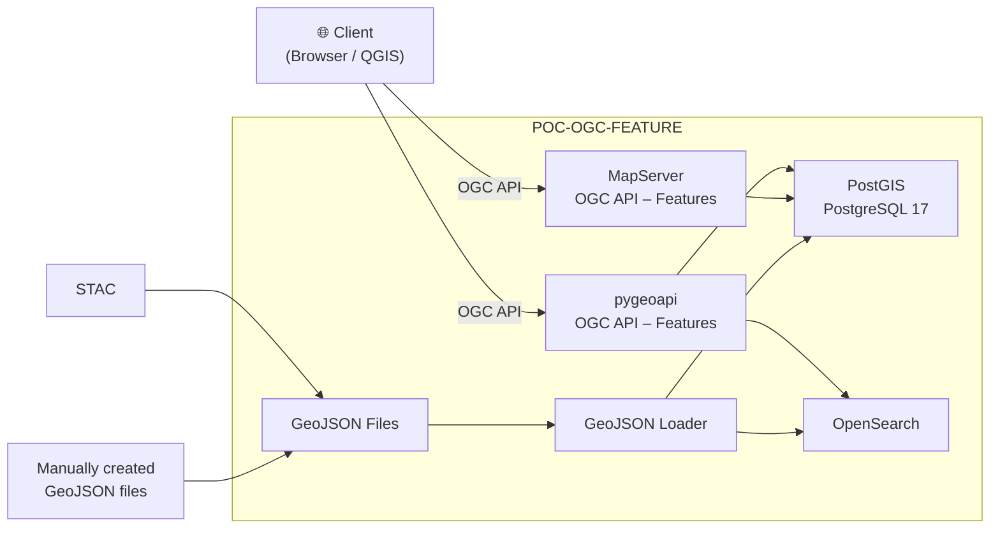

# MapServer vs PyGeoAPI

---

## Why are we comparing MapServer and PyGeoAPI?

Our goal by the end of the year:

**Serve ch.meteoschweiz.ogd-local-forecasting data via OGC API – Features.**

https://data.geo.admin.ch/browser/index.html#/collections/ch.meteoschweiz.ogd-local-forecasting?.language=en

---

## But... WTF is OGC API? And what's the Feature Part?

The **OGC API** is a family of standards for serving geospatial data over the web, built on REST/OpenAPI principles.

| Standard | Description |
| -------- | ----------- |
| **Common** | Shared building blocks (landing page, conformance, collections) used by all other OGC API standards |
| **Features** | Query, create, modify, and delete vector feature data (points, lines, polygons) |
| **Maps** | Request rendered map images (the modern successor to WMS) |
| **Tiles** | Retrieve pre-rendered or vector tiles of geospatial data for performant map display |
| **Records** | Discover and search geospatial resource metadata in catalogues |

---

## More niche standards for our Use Case

| Standard | Description |
| -------- | ----------- |
| **Coverages** | Access multi-dimensional raster data such as satellite imagery, sensor grids, and data cubes |
| **Processes** | Execute server-side geospatial processing tasks and chain workflows |
| **EDR** | Retrieve environmental data (weather, ocean, climate) by location, trajectory, or area |
| **Routes** | Compute and retrieve navigation routes between locations |
| **DGGS** | Access data organised on Discrete Global Grid Systems (hexagonal/triangular grids) |
| **Connected Systems** | Interact with IoT sensors, actuators, platforms, and their observation streams |

---

## Some basic facts

|                   | MapServer                                  | PyGeoAPI                                                    |
| ----------------- | ------------------------------------------ | ----------------------------------------------------------- |
| **License**       | MIT-style (MIT/X)                          | MIT                                                         |
| **Technology**    | C/C++ (FastCGI, WSGI)                      | Python (Flask), plugin-based architecture                   |
| **First released**| 1994 (University of Minnesota, also OSGeo) | 2018 (OSGeo community project)                              |
| **OGC standards** | WMS, WFS, WCS, OGC API – Features          | OGC API – Features, Records, Coverages, Tiles, Processes    |
| **Config**        | Text-based Mapfile format (.map)           | YAML-based configuration                                    |

---

# On-paper comparison

---

## Features

Features that are interesting for SWISSGEO:

| Feature | MapServer | PyGeoAPI |
|---|---|---|
| OGC API – Features | ✅ | ✅ |
| OGC API – Processes | ❌ | ✅ |
| OGC API – Records | ❌ | ✅ |
| WMS / WFS 1.x | ✅ | ❌ |
| Map rendering / cartography | ✅ | ❌ * |
| Tiling (WMTS / OGC Tiles) | ✅ | ✅ |
| OpenAPI / Swagger docs | ❌ | ✅ |

(*) Can delegate rendering to MapServer using mapscript (python bindings) or generalistic WMSFacade.

---

## Development activity (last year)

|                       | MapServer   | PyGeoAPI  |
|-----------------------|-------------|-----------|
| GitHub Stars          | 1179        | 592       |
| Releases (2025/26)    | 3           | 3         |
| Contributors          | 18          | 36        |
| Open Issues           | 298         | 31        |
| Forks                 | 402         | 313       |
| Codebase size         | ~16 MLoC    | ~49 KLoC  |

---

# DEMO

---

## DEMO Setup

---

# Observations from hands-on testing

---

| Capability | pygeoapi | MapServer | Notes |
|---|:---:|:---:|---|
| List items | Y | Y | Both return GeoJSON FeatureCollections |
| Single feature by ID | Y | Y | |
| `limit` parameter | Y | Y | |
| `offset` parameter | Y | Y | Pagination works on both |
| `bbox` filter | Y | Y | Both return correct spatial results |
| Property filter (e.g. `KTKZ=BE`) | Y | **N** | Not yet in `camptocamp/mapserver:8.6.0`. Coming in a future release ([commit](https://github.com/MapServer/MapServer/commit/d61a2654dcb45ab04bcbc6ed7d0c4dc8cf7d1356)). |
| `sortby` ascending | Y | **N** | Parameter silently ignored in current MapServer image |
| `sortby` descending (`-field`) | Y | **N** | Parameter silently ignored in current MapServer image |
| `queryables` endpoint | Y | Y | Both return JSON Schema |
| CRS output (`crs=EPSG:2056`) | Y | Y | Both reproject to LV95 |
| CRS bbox input (`bbox-crs`) | Y | Y | Both accept LV95 bbox coordinates |